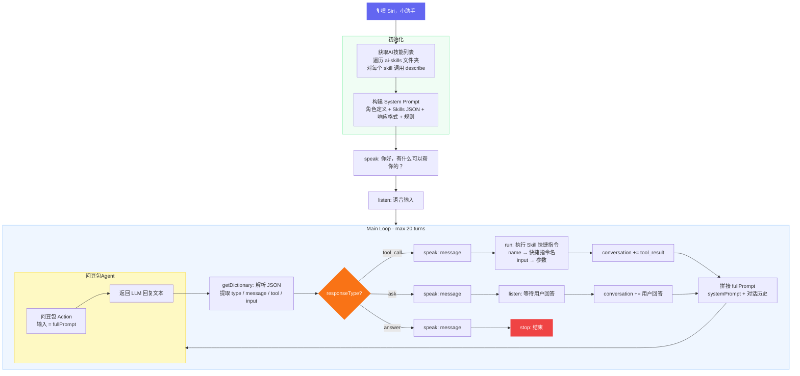

# 在 iPhone 快捷指令上实现了一个 AI Agent 框架

灵感来自 OpenClaw 的架构设计，在 iPhone 快捷指令上实现了一套 AI Agent 框架。LLM 用的是豆包 App 提供的「问豆包」快捷指令动作，不需要自己搭服务、不需要 API Key，装了豆包就能用。

整体流程：语音唤醒 → 豆包决策 → 调用 Skill → 结果回传 → 循环。

## 架构



## 核心设计

**LLM 只做决策，不直接执行。** 返回三种 JSON 指令：

- `tool_call` — 调用某个 Skill，带参数
- `ask` — 信息不足，追问用户
- `answer` — 直接回答，结束

**Skill 是自发现的。** 在快捷指令 app 里建一个 `ai-skills` 文件夹，放进去的每个快捷指令就是一个 Skill。Agent 启动时自动遍历文件夹，调用每个 Skill 的 `describe` 获取 JSON 声明（名称、描述、入参、出参），拼进 System Prompt。新增能力只需往文件夹里放一个快捷指令，不用改 Agent。

## 当前的局限

**Skill 的能力天花板 = 快捷指令的原生能力。**

目前 Skill 只能基于快捷指令本身的 Action 和第三方 App 提供的 App Intent 来实现。能做的事情比如读网页、发消息、查天气、控制 HomeKit、操作日历提醒这些，但也仅限于此。没有 App Intent 暴露的能力就调不了。


## 安装

代码用 [Cherri](https://github.com/electrikmilk/cherri) 写的，一门编译到 Apple Shortcuts 的编程语言。

### 编译安装

```bash
brew tap electrikmilk/cherri && brew install electrikmilk/cherri/cherri

cherri agent.cherri        # → 小助手.shortcut
cherri get-skills.cherri   # → 获取AI技能列表.shortcut
cherri search-web.cherri   # → ReadWebpage.shortcut
cherri run-shell.cherri    # → RunShell.shortcut
```

编译后双击 `.shortcut` 文件导入快捷指令 App，将 `ReadWebpage`、`RunShell` 等 Skill 放入 `ai-skills` 文件夹。

> **注意：** `ReadWebpage` 导入后需在快捷指令 App 中手动修改：找到「获取URL内容」步骤，将 JSON body 中的 `REPLACE_WITH_INPUT` 替换为实际的 `input` 变量。这是因为 Cherri 编译器将字典字面量按 JSON 解析，不支持在字典值中使用变量，但快捷指令 App 本身支持。

### 手动创建快捷指令

以下快捷指令使用了第三方 App Action，无法用 Cherri 编写，需在快捷指令 App 中手动创建：

**问豆包Agent**

1. 新建快捷指令，命名为 **问豆包Agent**
2. 添加豆包 App 的「问豆包」Action，输入设为「快捷指令输入」
3. 添加「停止并输出」，输出问豆包的回复

**RunShell**

1. 新建快捷指令，命名为 **RunShell**
2. 添加 a-Shell 的「Execute Command」Action，命令设为「快捷指令输入」
3. 添加「停止并输出」，输出执行结果

### 前置条件

- iPhone 上安装 [豆包 App](https://apps.apple.com/app/id6473141554) 并启用其快捷指令动作
- iPhone 上安装 [a-Shell](https://apps.apple.com/app/id1473805438)
- 注册 [LangSearch](https://langsearch.com) 获取 API Key（免费），填入 `search-web.cherri` 中的 `YOUR_LANGSEARCH_API_KEY`
- 在快捷指令 App 中创建 `ai-skills` 文件夹
